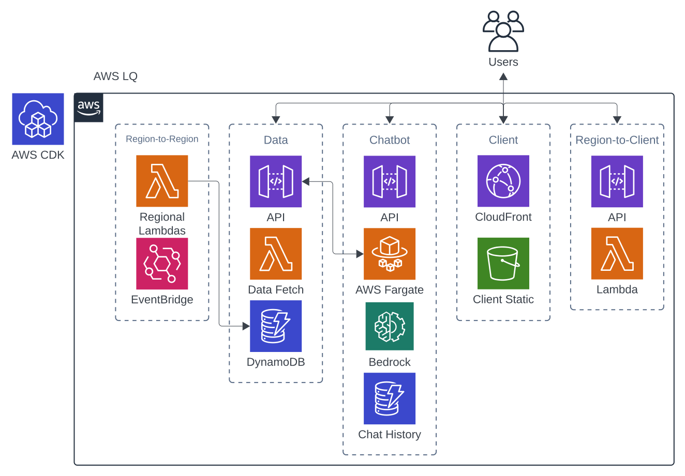

# Amazon LQ

Amazon LQ is a streamlined tool for querying latency information.  
Our tools provide precise latency data for region-to-region, region-to-client, and client-to-region testing, helping you ensure efficient and reliable network performance.  

## Setup & Deployment

Amazon LQ requires minimal setup and deployment before it is ready to be used. Follow the instructions below:  

### CDK Setup

Ensure that CDK is properly configured. This includes configuring the AWS CLI with the necessary permissions and bootstrapping the environment.  
Follow instructions [here](https://docs.aws.amazon.com/cdk/v2/guide/configure-env.html).  

### Environment Variables

Place .env file in the root directory and fill in the following variables:  
  
CHATBOT_API_KEY=  
AWS_DEFAULT_REGION= // in the form of "us-west-2"  
AWS_DEFAULT_ACCOUNT=  
BEDROCK_MODEL_ID=  
AWS_ACCESS_KEY_ID= // necessary for boto3 in Chatbot  
AWS_SECRET_ACCESS_KEY= // necessary for boto3 in Chatbot  

### Deploy

Run 'cdk deploy --all' to deploy the application.  
As the initial deployment can take a while, you may want to use the --require-approval never flag.  

## Cloud Architecture

Amazon LQ is designed to be modular and scalable.  
Aside from r2rFunctionStack, which is dependent on r2rDataStack, each stack can be deployed independently.  
Chatbot, Region-to-Region, and Region-to-Client can be accessed through API Gateway endpoints even when Client is not deployed.  
However, also note that the Chatbot contains the API for available services, which is used by Client.  