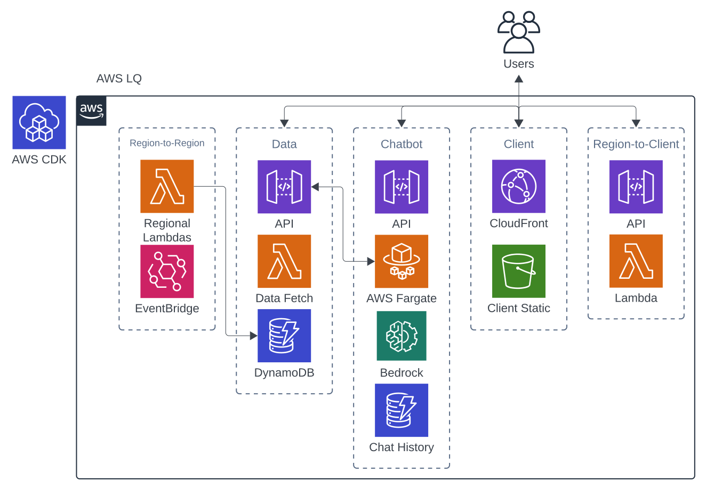

# Amazon LQ

Amazon LQ is a streamlined tool for querying latency information.  
Our tools provide precise latency data for region-to-region, region-to-client, and client-to-region testing, helping you ensure efficient and reliable network performance.  

## Setup & Deployment

Amazon LQ requires minimal setup and deployment before it is ready to be used. Follow the instructions below:  

### CDK Setup

Ensure that CDK is properly configured. This includes configuring the AWS CLI with the necessary permissions and bootstrapping the environment.  
Follow instructions [here](https://docs.aws.amazon.com/cdk/v2/guide/configure-env.html).  

### Environment Variables

Place .env file in the root directory and fill in the following variables:  
  
CHATBOT_API_KEY=  
AWS_DEFAULT_REGION= // in the form of "us-west-2"  
AWS_DEFAULT_ACCOUNT=  
BEDROCK_MODEL_ID=  
AWS_ACCESS_KEY_ID= // necessary for boto3 in Chatbot  
AWS_SECRET_ACCESS_KEY= // necessary for boto3 in Chatbot  

### Deploy

Run 'cdk deploy --all' to deploy the application.  
As the initial deployment can take a while, you may want to use the --require-approval never flag.  

## Cloud Architecture



Amazon LQ is designed to be modular and scalable.  
The Region-to-Region module, consisting of PingDBMain and regional LambdaStacks allows for collection, storage, and retrieval of latency data between AWS regions.  
The Region-to-Client module, consisting of regional R2CStacks, allows for collection of real-time latency data from AWS regions to a specified URL.  
The Chatbot module allows for users to retrieve latency data using natural language from a chatbot set up to answer AWS-related questions.  
The Client module allows for users to view latency data in a web application.  

## API Documentation

### Region-to-Region Module

#### Fetch Ping API

Endpoint for retrieving latency data between AWS regions.

**Endpoint**: `POST /fetch-ping`

**Input**:
```json
{
    "origin": "us-west-2",  
    "destinations": [  
        "us-east-1",
        "eu-west-1"
    ],
    "timeframe": "latest" // latest, 1d, 7d, 30d
}
```
**Output**:
- JSON object containing the latency data (ms) for each destination region
- HTTP status 400 if missing or invalid parameters
- HTTP status 500 if internal server error

### Region-to-Client Module

#### R2C API

Endpoint for retrieving latency data from AWS regions to a specified URL.

**Endpoint**: `POST /url-ping`

**Input**:
```json
{
    "host": "example.com"  
}
```

**Output**:
- JSON object containing:
```json
{
    "region": "aws-region-id",  
    "latency": 123.45  
}
```
- HTTP status 400 if host is missing or request body is invalid
- HTTP status 500 if ping fails or internal server error occurs

### Chatbot Module

#### Chat API

Endpoint for interacting with the chatbot and receiving streamed responses.

**Endpoint**: `POST /chat`

**Input**:
```json
{
    "input": "str",
    "session_id": "str",
    "time": "str"
}
```
**Output**:
- Plain text via HTTP stream
- Streams an `<|tool_call|>` token when calling tools

#### Chat History API

Endpoint for retrieving chat history for a specific session.

**Endpoint**: `POST /get-history`

**Input**:
```json
{
    "session_id": "str"
}
```
**Output**:
- Plain text JSON containing chat history
- HTTP status 404 if history is not found

#### Delete History API

Endpoint for deleting chat history for a specific session.

**Endpoint**: `POST /delete-history`

**Input**:
```json
{
    "session_id": "str"
}
```
**Output**:
- HTTP status 204 (No Content)
- If history is not found, returns HTTP status 204 and does nothing
- If deletion is not successful, returns HTTP status 409

#### Generate Title API

Endpoint for generating a title based on chat history.

**Endpoint**: `POST /generate-title`

**Input**:
```json
{
    "session_id": "str"
}
```
**Output**:
- Plain text title
- HTTP status 404 if history is not found

#### Available Services API

Endpoint for retrieving AWS services available in a specific region.

**Endpoint**: `POST /available-services`

**Input**:
```json
{
    "region_name": "str"
}
```
**Output**:
- JSON object containing the list of available services
- HTTP status 400 if there's an error processing the request